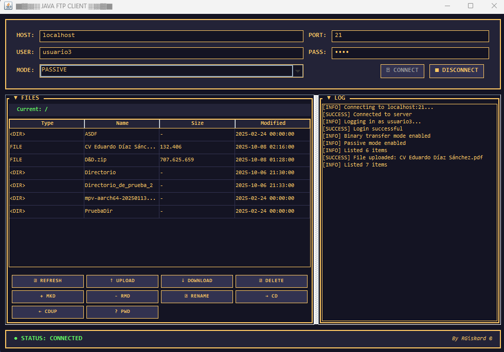

# Java FTP Server & Client

[](LICENSE)
[](https://www.oracle.com/java/)
[](https://commons.apache.org/proper/commons-net/)

-----

Una implementación personalizada del Protocolo de Transferencia de Archivos (FTP) en Java que incluye un servidor multihilo con control de acceso basado en roles (RBAC), un cliente GUI de estilo retro y un modo de consola interactivo construido sobre Apache Commons Net.

-----

## Índice

  - [Resumen](#resumen)
  - [Características](#características)
  - [Arquitectura](#arquitectura)
  - [Prerrequisitos](#prerrequisitos)
  - [Instalación](#instalación)
  - [Inicio Rápido](#inicio-rápido)
  - [Uso](#uso)
      - [Ejecutar el Servidor](#ejecutar-el-servidor)
      - [Ejecutar el Cliente](#ejecutar-el-cliente)
  - [Configuración](#configuración)
  - [Modos de Transferencia FTP](#modos-de-transferencia-ftp)
  - [Control de Acceso Basado en Roles](#control-de-acceso-basado-en-roles)
  - [Seguridad](#seguridad)
  - [Solución de Problemas](#solución-de-problemas)
  - [Contribuciones](#contribuciones)
  - [Licencia](#licencia)
  - [Agradecimientos](#agradecimientos)

-----

## Resumen

Este proyecto es una implementación educativa completa del Protocolo de Transferencia de Archivos (FTP) en Java, construido desde cero para demostrar:

  - **Programación de Red**: Programación de sockets, multihilo y arquitectura cliente-servidor.
  - **Implementación de Protocolos**: Manejo de comandos/respuestas FTP conforme al RFC 959.
  - **Sistemas Concurrentes**: Gestión de un pool de hilos para múltiples conexiones simultáneas.
  - **Desarrollo de GUI**: Interfaz retro basada en Swing con actualizaciones en tiempo real.
  - **Patrones de Seguridad**: Control de acceso basado en roles (RBAC) y sistemas de autenticación.

### Vista Previa de la Interfaz

<p align="center">
  
  <br>
  <em>Cliente FTP con interfaz gráfica estilo terminal retro ámbar</em>
</p>

### Componentes

| Componente | Archivo | Descripción |
|-----------|------|-------------|
| **Servidor** | [JavaFtpServer.java](src/FTP/Server/JavaFtpServer.java) | Servidor FTP multihilo que soporta los modos de transferencia ACTIVO y PASIVO. |
| **Cliente de Consola** | [JavaFtpClient.java](src/FTP/Client/JavaFtpClient.java) | Cliente FTP interactivo de línea de comandos usando Apache Commons Net. |
| **Cliente GUI** | [ClientGUI.java](src/FTP/Client/ClientGUI.java) | Interfaz gráfica de estilo terminal retro ámbar para operaciones FTP. |
| **Dependencia** | `commons-net-3.11.1.jar` | Biblioteca Apache Commons Net (incluida en [lib/](lib/)). |

### ¿Qué Aprenderás?

Al estudiar y ejecutar este proyecto, entenderás:

✓ Cómo funciona el protocolo FTP a nivel de red (canales de control y de datos).
✓ Cómo implementar el análisis de comandos y los códigos de respuesta del lado del servidor.
✓ Cómo gestionar conexiones de clientes concurrentes con pools de hilos.
✓ Cómo manejar los modos de transferencia de datos ACTIVO y PASIVO.
✓ Cómo construir sistemas de permisos basados en roles.
✓ Cómo crear aplicaciones de escritorio con GUI usando Java Swing.
✓ Cómo trabajar con E/S de archivos y flujos de red.

-----

## Características

### Capacidades del Servidor

  - **Conexiones Concurrentes**: Arquitectura multihilo que utiliza `ExecutorService` para manejar múltiples clientes simultáneos.
  - **Autenticación de Usuarios**: Sistema de autenticación basado en archivos con credenciales en texto plano almacenadas en `files/users/users.txt`.
  - **Control de Acceso Basado en Roles (RBAC)**: Sistema de permisos de tres niveles:
      - `BASICO` — Acceso de solo lectura (LIST, RETR, CWD, PWD).
      - `INTERMEDIO` — Acceso de lectura/escritura (añade STOR, MKD, RMD, RNFR, RNTO, DELE).
      - `ADMINISTRADOR` — Acceso administrativo completo.
  - **Modos de Transferencia Duales**:
      - **Modo PASIVO** — El servidor abre un puerto de datos y el cliente se conecta (compatible con NAT/firewall).
      - **Modo ACTIVO** — El cliente abre un puerto de datos y el servidor se conecta (requiere redirección de puertos en el cliente).
  - **Soporte de Comandos FTP**: USER, PASS, SYST, PASV, PORT, LIST, STOR, RETR, DELE, MKD, RMD, RNFR, RNTO, CWD, CDUP, PWD, QUIT.

### Características del Cliente

#### Modo Consola

  - Menú interactivo con 10 operaciones FTP.
  - Configuración de conexión de host/puerto personalizable.
  - Selección del modo de transferencia (PASIVO/ACTIVO).
  - Feedback de las operaciones en tiempo real.

#### Modo GUI

  - **Diseño Retro**: Estética de terminal ámbar inspirada en los años 80.
  - **Tabla de Archivos**: Visualización con tipo de archivo, nombre, tamaño y fecha de modificación.
  - **Botones Dedicados**: Acceso con un clic a 10 operaciones FTP (REFRESH, UPLOAD, DOWNLOAD, DELETE, MKD, RMD, RENAME, CD, CDUP, PWD).
  - **Registro en Tiempo Real**: Mensajes codificados por colores (verde=éxito, rojo=error, amarillo=info).
  - **Tipografía Monoespaciada**: Fuente Consolas para una apariencia retro auténtica.
  - **Barras de Progreso**: Indicadores visuales en tiempo real para transferencias de archivos.
  - **Selección Múltiple**: Operaciones batch con Ctrl+Click o Shift+Click.
  - **Navegación Intuitiva**: Doble clic en directorios para navegar.
  - **Encoding UTF-8**: Soporte completo para nombres con acentos, ñ y caracteres especiales.
  - **Transferencia Binaria**: Configuración automática para archivos PDF, ZIP, imágenes y binarios.

-----

## Arquitectura

```
java-ftp/
├── src/
│   └── FTP/
│       ├── Client/
│       │   ├── JavaFtpClient.java      # Punto de entrada del cliente de consola
│       │   ├── ClientFunctions.java    # Implementaciones de comandos del cliente
│       │   └── ClientGUI.java          # Cliente GUI (interfaz retro)
│       ├── Server/
│       │   ├── JavaFtpServer.java      # Punto de entrada del servidor
│       │   ├── FtpClientHandler.java   # Manejador por conexión (Runnable)
│       │   ├── ServerFunctions.java    # Implementaciones de comandos FTP
│       │   ├── User.java               # Modelo de credenciales de usuario
│       │   └── UserProfile.java        # Enum para RBAC
│       └── Util/
│           └── Util.java               # Utilidades compartidas
├── lib/
│   └── commons-net-3.11.1.jar          # Biblioteca Apache Commons Net
├── files/
│   └── users/
│       └── users.txt                   # Base de datos de credenciales de usuario
├── bin/                                # Clases compiladas (generado)
├── [LICENSE](LICENSE)
└── [README.md](README.md)
```

-----

## Prerrequisitos

  - **JDK**: 8 o superior.
  - **Shell**: PowerShell (Windows) o Bash (Linux/macOS).
  - **Red**: El puerto 21 debe estar disponible (o modificar `CONTROL_PORT` para pruebas en puertos no privilegiados \>1024).

-----

## Instalación

### Comprobación de Prerrequisitos

Antes de la instalación, verifica tu entorno:

```bash
# Comprobar la versión de Java (debe ser 8+)
java -version
javac -version

# Verificar la estructura del proyecto
ls lib/commons-net-3.11.1.jar  # Debería existir
```

### 1\. Clona el Repositorio

```bash
git clone <url-del-repositorio>
cd java-ftp
```

### 2\. Configura la Estructura del Proyecto

Crea los directorios necesarios:

```bash
# Windows (PowerShell)
mkdir -Force bin, files\users

# Linux/macOS
mkdir -p bin files/users
```

### 3\. Configura los Usuarios

Crea `files/users/users.txt` con usuarios iniciales:

```bash
# Windows (PowerShell)
@"
admin:admin789:ADMINISTRADOR
alice:pass123:BASICO
bob:secret456:INTERMEDIO
"@ | Out-File -FilePath "files\users\users.txt" -Encoding ASCII

# Linux/macOS
cat > files/users/users.txt << 'EOF'
admin:admin789:ADMINISTRADOR
alice:pass123:BASICO
bob:secret456:INTERMEDIO
EOF
```

**Formato de Usuario**: `nombre_usuario:contraseña:PERFIL`

**Perfiles Disponibles**:

  - `BASICO` - Solo lectura (listar, descargar).
  - `INTERMEDIO` - Lectura/escritura (añade subir, eliminar, renombrar).
  - `ADMINISTRADOR` - Acceso completo.

### 4\. Compila el Proyecto

#### Windows (PowerShell)

```powershell
javac -d bin -cp "lib/commons-net-3.11.1.jar" `
  src\FTP\Client\*.java `
  src\FTP\Server\*.java `
  src\FTP\Util\*.java
```

**Verificar compilación**:

```powershell
ls bin\FTP\Server\JavaFtpServer.class  # Debería existir
```

#### Linux/macOS (Bash)

```bash
javac -d bin -cp "lib/commons-net-3.11.1.jar" \
  src/FTP/Client/*.java \
  src/FTP/Server/*.java \
  src/FTP/Util/*.java
```

**Verificar compilación**:

```bash
ls bin/FTP/Server/JavaFtpServer.class  # Debería existir
```

### 5\. Haz los Scripts Ejecutables (solo Linux/macOS)

```bash
chmod +x run-client-gui.sh
```

### Instalación Completa

Ahora estás listo para ejecutar el servidor y el cliente. Procede a [Inicio Rápido](https://www.google.com/search?q=%23inicio-r%C3%A1pido).

-----

## Inicio Rápido

> 💡 **¿Primera vez?** Consulta [QUICK_START.md](QUICK_START.md) para una guía visual paso a paso.

Sigue estos pasos para poner en marcha el servidor y el cliente FTP:

### Paso 1: Configura las Credenciales de Usuario

Crea la estructura de directorios necesaria y el archivo de usuarios:

```bash
# Windows (PowerShell)
mkdir -Force files\users
New-Item -Path "files\users\users.txt" -ItemType File -Force

# Linux/macOS
mkdir -p files/users
touch files/users/users.txt
```

Añade las credenciales de usuario a `files/users/users.txt`:

```text
admin:admin789:ADMINISTRADOR
alice:pass123:BASICO
bob:secret456:INTERMEDIO
```

### Paso 2: Compila el Proyecto

```bash
# Windows (PowerShell)
mkdir -Force bin
javac -d bin -cp "lib/commons-net-3.11.1.jar" src\FTP\Client\*.java src\FTP\Server\*.java src\FTP\Util\*.java

# Linux/macOS
mkdir -p bin
javac -d bin -cp "lib/commons-net-3.11.1.jar" src/FTP/Client/*.java src/FTP/Server/*.java src/FTP/Util/*.java
```

**Resultado esperado**: Sin errores. Los archivos `.class` compilados estarán en el directorio `bin/`.

### Paso 3: Inicia el Servidor FTP

Abre una ventana de terminal y ejecuta:

```bash
# Windows (PowerShell)
java -cp "bin;lib/commons-net-3.11.1.jar" FTP.Server.JavaFtpServer

# Linux/macOS (puede requerir sudo para el puerto 21)
java -cp "bin:lib/commons-net-3.11.1.jar" FTP.Server.JavaFtpServer
```

Cuando se te solicite:

1.  Introduce el directorio raíz: `files`
2.  El servidor mostrará: `✓ Servidor escuchando en el puerto 21`

**Mantén esta terminal abierta** - el servidor debe ejecutarse continuamente.

### Paso 4: Inicia el Cliente FTP

Abre una **nueva ventana de terminal** (mantén el servidor en ejecución) y elige una de las siguientes opciones:

#### Opción A: Cliente GUI (Recomendado)

```bash
# Windows
.\run-client-gui.bat

# Linux/macOS
chmod +x run-client-gui.sh
./run-client-gui.sh
```

En la ventana de la GUI:

1.  **Host**: `localhost`
2.  **Puerto**: `21`
3.  **Usuario**: `admin`
4.  **Contraseña**: `admin789`
5.  **Modo**: Selecciona `PASSIVE`
6.  Haz clic en **"▶ CONNECT"**

Deberías ver un mensaje de éxito en verde y la lista de archivos se cargará.

#### Opción B: Cliente de Consola

```bash
# Windows (PowerShell)
java -cp "bin;lib/commons-net-3.11.1.jar" FTP.Client.JavaFtpClient

# Linux/macOS
java -cp "bin:lib/commons-net-3.11.1.jar" FTP.Client.JavaFtpClient
```

Cuando se te solicite:

1.  **Servidor**: `localhost` (pulsa Enter)
2.  **Puerto**: `21` (pulsa Enter)
3.  **Usuario**: `admin`
4.  **Contraseña**: `admin789`
5.  **Modo**: `1` (para PASIVO)

### Paso 5: Verifica la Conexión

Deberías ver:

  - **Terminal del servidor**: `✓ Usuario 'admin' ha iniciado sesión correctamente`
  - **Cliente**: Listado de archivos o menú interactivo.

### Problemas Comunes

| Problema | Solución |
|---|---|
| `Address already in use` | El puerto 21 está ocupado. Cambia `CONTROL_PORT` en [JavaFtpServer.java](src/FTP/Server/JavaFtpServer.java) línea 41 a `2121`. |
| `Permission denied` (Linux/macOS) | Ejecuta el servidor con `sudo` o usa un puerto \>1024. |
| `ClassNotFoundException` | Verifica que `commons-net-3.11.1.jar` exista en el directorio `lib/`. |
| `Connection refused` | Asegúrate de que el servidor esté en ejecución y escuchando en el puerto correcto. |
| Fallo de autenticación | Comprueba que `files/users/users.txt` exista con el formato correcto. |

### Próximos Pasos

  - Sube un archivo usando la opción `[2]` en la consola o el botón **UPLOAD** en la GUI.
  - Navega por los directorios con `[8]` o haciendo doble clic en las carpetas en la GUI.
  - Prueba diferentes cuentas de usuario con distintos niveles de permiso.
  - Lee la sección de [Uso](#uso) para operaciones detalladas.

-----

## Uso

### Ejecutar el Servidor

#### Iniciar el Servidor

**Windows (PowerShell):**

```powershell
java -cp "bin;lib/commons-net-3.11.1.jar" FTP.Server.JavaFtpServer
```

**Linux/macOS:**

```bash
# Puerto estándar 21 (requiere sudo)
sudo java -cp "bin:lib/commons-net-3.11.1.jar" FTP.Server.JavaFtpServer

# Alternativa: Puerto no privilegiado (cambia CONTROL_PORT a 2121 primero)
java -cp "bin:lib/commons-net-3.11.1.jar" FTP.Server.JavaFtpServer
```

#### Flujo de Inicio del Servidor

```
┌─────────────────────────────────────┐
│   1. Visualización del Banner ASCII │
└──────────────┬──────────────────────┘
               │
┌──────────────▼──────────────────────┐
│   2. Petición: Directorio raíz      │
│      Entrada: files                 │
└──────────────┬──────────────────────┘
               │
┌──────────────▼──────────────────────┐
│   3. Validar Estructura             │
│      ✓ files/ existe                │
│      ✓ files/users/users.txt existe │
└──────────────┬──────────────────────┘
               │
┌──────────────▼──────────────────────┐
│   4. Iniciar Escucha                │
│      Servidor escuchando en puerto 21 │
└──────────────┬──────────────────────┘
               │
┌──────────────▼──────────────────────┐
│   5. Listo para Conexiones          │
│      [LOG] Esperando clientes...    │
└─────────────────────────────────────┘
```

#### Explicación de los Logs del Servidor

```
✓ Servidor escuchando en el puerto 21      # Servidor iniciado correctamente
✓ Cliente conectado: /127.0.0.1:54321      # Nueva conexión de cliente
✓ Usuario 'admin' ha iniciado sesión       # Autenticación exitosa
⇄ LIST: /files/                            # Solicitud de listado de archivos
⇄ RETR: document.txt                       # Descarga de archivo
⇄ STOR: upload.jpg                         # Carga de archivo
✗ Acceso denegado para el usuario 'alice'  # Error de permisos
✓ Cliente desconectado: admin              # Cliente cerró sesión
```

#### Notas para Despliegue en Producción

**Para uso en producción** (no recomendado - ver [Seguridad](https://www.google.com/search?q=%23seguridad)):

1.  **Cambiar Puerto por Defecto** (Linux/macOS):

    ```bash
    # Editar src/FTP/Server/JavaFtpServer.java
    private static final int CONTROL_PORT = 2121;  // Usar un puerto no privilegiado
    ```

2.  **Ejecutar como Servicio del Sistema**:

    ```bash
    # Crear un servicio systemd (Linux)
    sudo nano /etc/systemd/system/ftp-server.service
    ```

3.  **Configurar el Firewall**:

    ```bash
    # Permitir puertos FTP
    sudo ufw allow 21/tcp
    sudo ufw allow 20/tcp
    sudo ufw allow 1024:65535/tcp  # Puertos para modo pasivo
    ```

**Nota**: En sistemas Unix, vincularse al puerto 21 requiere privilegios de root/sudo. Para desarrollo/pruebas, modifica `CONTROL_PORT` en [JavaFtpServer.java](src/FTP/Server/JavaFtpServer.java) línea 41 a un puerto \>1024 (ej. `2121`).

### Ejecutar el Cliente

#### Modo Consola

**PowerShell:**

```powershell
java -cp "bin;lib/commons-net-3.11.1.jar" FTP.Client.JavaFtpClient
```

**Linux/macOS:**

```bash
java -cp "bin:lib/commons-net-3.11.1.jar" FTP.Client.JavaFtpClient
```

##### Flujo de Conexión en Consola

1.  Introduce el nombre de host (por defecto: `localhost`).
2.  Introduce el puerto (por defecto: `21`).
3.  Proporciona nombre de usuario y contraseña.
4.  Selecciona el modo de transferencia (`PASSIVE` o `ACTIVE`).

##### Menú de la Consola

```
[1]  Listar archivos
[2]  Subir archivo
[3]  Descargar archivo
[4]  Eliminar archivo
[5]  Crear directorio
[6]  Eliminar directorio
[7]  Renombrar archivo/directorio
[8]  Cambiar directorio de trabajo
[9]  Cambiar al directorio padre
[10] Salir
```

#### Modo GUI

**PowerShell:**

```powershell
java -cp "bin;lib/commons-net-3.11.1.jar" FTP.Client.ClientGUI

# O usa el script de conveniencia:
.\run-client-gui.bat
```

**Linux/macOS:**

```bash
java -cp "bin:lib/commons-net-3.11.1.jar" FTP.Client.ClientGUI

# O usa el script de conveniencia:
./run-client-gui.sh
```

##### Flujo de Conexión en la GUI

1.  Rellena los campos: Host, Puerto, Usuario, Contraseña.
2.  Selecciona el modo (PASSIVE/ACTIVE).
3.  Haz clic en "▶ CONNECT".
4.  Navega por los archivos usando la tabla y los botones de operación.

-----

## Configuración

### Configuración de Usuarios

Crea el archivo de usuarios en `files/users/users.txt` con el siguiente formato:

```
nombre_usuario:contraseña:PERFIL
```

**Perfiles**: `BASICO`, `INTERMEDIO`, `ADMINISTRADOR`

**Ejemplo:**

```
alice:pass123:BASICO
bob:secret456:INTERMEDIO
admin:admin789:ADMINISTRADOR
```

-----

## Modos de Transferencia FTP

### Modo PASIVO (Recomendado)

  - **Cuándo usarlo**: Cliente detrás de un NAT/firewall.
  - **Cómo funciona**:
    1.  El cliente envía el comando `PASV`.
    2.  El servidor abre un puerto aleatorio y envía los detalles de conexión.
    3.  El cliente se conecta a ese puerto para la transferencia de datos.
  - **Configuración**: Manejado automáticamente por el cliente.

### Modo ACTIVO

  - **Cuándo usarlo**: Cliente con IP pública o redirección de puertos adecuada.
  - **Cómo funciona**:
    1.  El cliente abre un puerto local y envía el comando `PORT` con los detalles de conexión.
    2.  El servidor se conecta al puerto especificado por el cliente para la transferencia de datos.
  - **Configuración**: El cliente solicita un puerto de datos (se recomienda \>5000).

-----

## Control de Acceso Basado en Roles

| Comando | BASICO | INTERMEDIO | ADMINISTRADOR |
|---|:---:|:---:|:---:|
| LIST | ✓ | ✓ | ✓ |
| RETR | ✓ | ✓ | ✓ |
| CWD | ✓ | ✓ | ✓ |
| CDUP | ✓ | ✓ | ✓ |
| PWD | ✓ | ✓ | ✓ |
| STOR | ✗ | ✓ | ✓ |
| DELE | ✗ | ✓ | ✓ |
| MKD | ✗ | ✓ | ✓ |
| RMD | ✗ | ✓ | ✓ |
| RNFR | ✗ | ✓ | ✓ |
| RNTO | ✗ | ✓ | ✓ |

*Los comandos no autorizados devuelven: `530 Not logged in` o el código de error apropiado.*

-----

## Seguridad

### ⚠️ PROYECTO EDUCATIVO — NO APTO PARA PRODUCCIÓN

Esta implementación está diseñada con fines de aprendizaje y contiene varias limitaciones de seguridad.

#### Limitaciones de Seguridad Conocidas

  - Almacenamiento de contraseñas en texto plano en `users.txt`.
  - Sin cifrado TLS/SSL para los canales de control o de datos.
  - Validación de entrada básica sin sanitización exhaustiva.
  - Sin limitación de velocidad o protección contra fuerza bruta.
  - Protección de un solo nivel contra el recorrido de directorios (directory traversal).

#### Recomendaciones para Producción

Antes de usar en producción, implementa:

  - Hashing de contraseñas (bcrypt/Argon2) con sales.
  - Cifrado TLS (FTPS).
  - Validación exhaustiva de rutas contra directory traversal.
  - Limitación de intentos de autenticación.
  - Registros de auditoría.
  - Cuotas de recursos por usuario.
  - Alternativas modernas (SFTP, APIs de archivos sobre HTTPS).

-----

## Solución de Problemas

### Permiso Denegado en el Puerto 21 (Linux/macOS)

```bash
# Opción 1: Ejecutar con sudo (no recomendado para desarrollo)
sudo java -cp "bin:lib/commons-net-3.11.1.jar" FTP.Server.JavaFtpServer

# Opción 2: Usar un puerto no privilegiado (recomendado)
# Modifica CONTROL_PORT en JavaFtpServer.java a 2121
```

### Conexión Rechazada (Connection Refused)

  - Verifica que el servidor esté en ejecución (`netstat -an | grep 21`).
  - Comprueba que las reglas del firewall permitan el tráfico en el puerto 21.
  - Confirma que el cliente se esté conectando al host/puerto correcto.

### Fallo de Autenticación

  - Verifica que `files/users/users.txt` exista y tenga el formato correcto.
  - Comprueba si hay espacios en blanco al final de las entradas de usuario/contraseña.
  - Asegúrate de que el perfil de usuario sea un valor enum válido.

### Errores de Compilación

```bash
# Verificar la versión de JDK
java -version

# Asegurarse de que el JAR de commons-net existe
ls lib/commons-net-3.11.1.jar

# Limpiar y reconstruir
rm -rf bin
mkdir bin
javac -d bin -cp "lib/commons-net-3.11.1.jar" src/FTP/**/*.java
```

-----

## Contribuciones

¡Las contribuciones son bienvenidas\! Por favor, siéntete libre de enviar:

  - Informes de errores a través de issues en el repositorio.
  - Mejoras de funcionalidades a través de Pull Requests.
  - Mejoras en la documentación.
  - Informes de vulnerabilidades de seguridad (por favor, divúlguelos de manera responsable).

### Áreas de Desarrollo

  - Añadir soporte para TLS/SSL.
  - Implementar almacenamiento seguro de contraseñas.
  - Añadir pruebas unitarias exhaustivas.
  - Soportar comandos FTP adicionales (ABOR, REST, STAT).
  - Soporte para IPv6.
  - Archivo de configuración para los ajustes del servidor.

### Guía para Contribuir

1.  Haz un fork del repositorio.
2.  Crea una rama para tu nueva característica (`git checkout -b feature/amazing-feature`).
3.  Confirma tus cambios (`git commit -m 'Add amazing feature'`).
4.  Sube la rama a tu fork (`git push origin feature/amazing-feature`).
5.  Abre un Pull Request.

-----

## Licencia

Este proyecto está licenciado bajo la **Licencia MIT** — consulta el archivo [LICENSE](LICENSE) para más detalles.

-----

## Agradecimientos

  - Construido con la biblioteca [Apache Commons Net](https://commons.apache.org/proper/commons-net/).
  - Protocolo FTP: [RFC 959](https://tools.ietf.org/html/rfc959).
  - Desarrollado con fines educativos para comprender los protocolos de red y la programación de sockets en Java.

-----

## Referencias

  - [RFC 959 - File Transfer Protocol (FTP)](https://tools.ietf.org/html/rfc959)
  - [Documentación de Apache Commons Net](https://commons.apache.org/proper/commons-net/javadocs/api-3.11.1/)
  - [Guía de Programación de Red en Java](https://docs.oracle.com/javase/tutorial/networking/)

-----

<p align="center">
  <small>Desarrollado por <b>Edu Díaz</b> a.k.a <b>RGiskard7</b> ❤️</small>
</p>