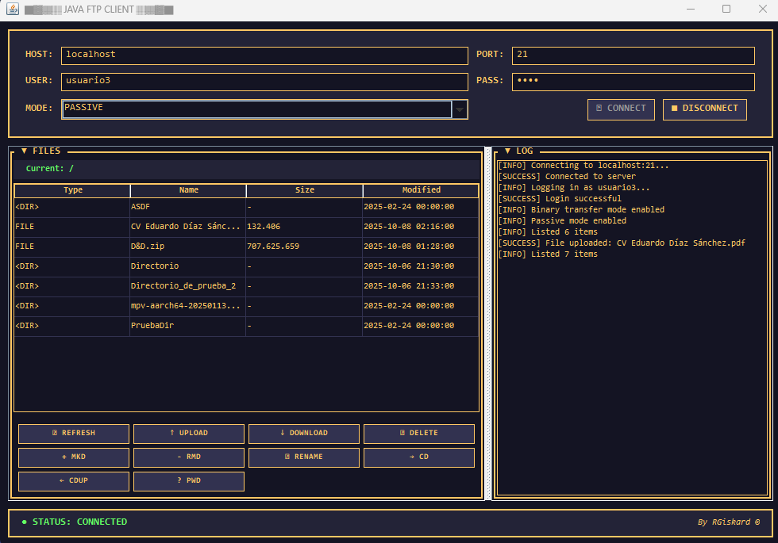

# Java FTP Server & Client

[](LICENSE)
[](https://www.oracle.com/java/)
[](https://commons.apache.org/proper/commons-net/)

-----

Una implementación personalizada del Protocolo de Transferencia de Archivos (FTP) en Java que incluye un servidor multihilo con control de acceso basado en roles (RBAC), un cliente GUI de estilo retro y un modo de consola interactivo construido sobre Apache Commons Net.

-----

## Índice

  - [Resumen](#resumen)
  - [Características](#características)
  - [Arquitectura](#arquitectura)
  - [Prerrequisitos](#prerrequisitos)
  - [Instalación](#instalación)
  - [Compilación y ejecución](#compilación-y-ejecución)
      - [Primera vez: no tengo usuarios ni base de datos](#primera-vez-no-tengo-usuarios-ni-base-de-datos)
  - [Inicio Rápido](#inicio-rápido)
  - [Uso](#uso)
      - [Ejecutar el Servidor](#ejecutar-el-servidor)
      - [Ejecutar el Cliente](#ejecutar-el-cliente)
  - [Configuración](#configuración)
      - [Rutas en Windows](#rutas-en-windows)
      - [Habilitar FTPS (TLS)](#habilitar-ftps-tls)
  - [Modos de Transferencia FTP](#modos-de-transferencia-ftp)
  - [Control de Acceso Basado en Roles](#control-de-acceso-basado-en-roles)
  - [Seguridad](#seguridad)
  - [Despliegue en producción](#despliegue-en-producción)
  - [Solución de Problemas](#solución-de-problemas)
  - [Contribuciones](#contribuciones)
  - [Licencia](#licencia)
  - [Agradecimientos](#agradecimientos)

-----

## Resumen

Este proyecto es una implementación educativa completa del Protocolo de Transferencia de Archivos (FTP) en Java, construido desde cero para demostrar:

  - **Programación de Red**: Programación de sockets, multihilo y arquitectura cliente-servidor.
  - **Implementación de Protocolos**: Manejo de comandos/respuestas FTP conforme al RFC 959.
  - **Sistemas Concurrentes**: Gestión de un pool de hilos para múltiples conexiones simultáneas.
  - **Desarrollo de GUI**: Interfaz retro basada en Swing con actualizaciones en tiempo real.
  - **Patrones de Seguridad**: Control de acceso basado en roles (RBAC) y sistemas de autenticación.

### Vista Previa de la Interfaz

<p align="center">
  
  <br>
  <em>Cliente FTP con interfaz gráfica estilo terminal retro ámbar</em>
</p>

### Componentes

| Componente | Archivo | Descripción |
|-----------|------|-------------|
| **Servidor** | [JavaFtpServer.java](src/FTP/Server/JavaFtpServer.java) | Servidor FTP multihilo que soporta los modos de transferencia ACTIVO y PASIVO. |
| **Cliente de Consola** | [JavaFtpClient.java](src/FTP/Client/JavaFtpClient.java) | Cliente FTP interactivo de línea de comandos usando Apache Commons Net. |
| **Cliente GUI** | [ClientGUI.java](src/FTP/Client/ClientGUI.java) | Interfaz gráfica de estilo terminal retro ámbar para operaciones FTP. |
| **Panel Admin** | [AdminGUI.java](src/FTP/Admin/AdminGUI.java) | Aplicación Swing para gestionar usuarios en la base SQLite (añadir, editar, activar/desactivar). |
| **Dependencia** | `commons-net-3.11.1.jar` | Biblioteca Apache Commons Net (incluida en [lib/](lib/)). |

### ¿Qué Aprenderás?

Al estudiar y ejecutar este proyecto, entenderás:

- Cómo funciona el protocolo FTP a nivel de red (canales de control y de datos).
- Cómo implementar el análisis de comandos y los códigos de respuesta del lado del servidor.
- Cómo gestionar conexiones de clientes concurrentes con pools de hilos.
- Cómo manejar los modos de transferencia de datos ACTIVO y PASIVO.
- Cómo construir sistemas de permisos basados en roles.
- Cómo crear aplicaciones de escritorio con GUI usando Java Swing.
- Cómo trabajar con E/S de archivos y flujos de red.

-----

## Características

### Capacidades del Servidor

  - **Conexiones Concurrentes**: Arquitectura multihilo que utiliza `ExecutorService` para manejar múltiples clientes simultáneos.
  - **Autenticación de Usuarios**: Soporte para SQLite (recomendado) o fichero TXT; contraseñas con hash bcrypt. Gestión de usuarios con el panel Admin o la herramienta PasswordTool (modo fichero).
  - **Control de Acceso Basado en Roles (RBAC)**: Sistema de permisos de tres niveles:
      - `BASICO` — Acceso de solo lectura (LIST, RETR, CWD, PWD).
      - `INTERMEDIO` — Acceso de lectura/escritura (añade STOR, MKD, RMD, RNFR, RNTO, DELE).
      - `ADMINISTRADOR` — Acceso administrativo completo.
  - **Modos de Transferencia Duales**:
      - **Modo PASIVO** — El servidor abre un puerto de datos y el cliente se conecta (compatible con NAT/firewall).
      - **Modo ACTIVO** — El cliente abre un puerto de datos y el servidor se conecta (requiere redirección de puertos en el cliente).
  - **Soporte de Comandos FTP**: USER, PASS, SYST, FEAT, OPTS UTF8, NOOP, PASV, PORT, LIST, STOR, RETR, SIZE, MDTM, DELE, MKD, RMD, RNFR, RNTO, CWD, CDUP, PWD, QUIT.

### Características del Cliente

#### Modo Consola

  - Menú interactivo con 10 operaciones FTP.
  - Configuración de conexión de host/puerto personalizable.
  - Selección del modo de transferencia (PASIVO/ACTIVO).
  - Feedback de las operaciones en tiempo real.

#### Modo GUI

  - **Diseño Retro**: Estética de terminal ámbar inspirada en los años 80.
  - **Tabla de Archivos**: Visualización con tipo de archivo, nombre, tamaño y fecha de modificación.
  - **Botones Dedicados**: Acceso con un clic a 10 operaciones FTP (REFRESH, UPLOAD, DOWNLOAD, DELETE, MKD, RMD, RENAME, CD, CDUP, PWD).
  - **Registro en Tiempo Real**: Mensajes codificados por colores (verde=éxito, rojo=error, amarillo=info).
  - **Tipografía Monoespaciada**: Fuente Consolas para una apariencia retro auténtica.
  - **Barras de Progreso**: Indicadores visuales en tiempo real para transferencias de archivos.
  - **Selección Múltiple**: Operaciones batch con Ctrl+Click o Shift+Click.
  - **Navegación Intuitiva**: Doble clic en directorios para navegar.
  - **Encoding UTF-8**: Soporte completo para nombres con acentos, ñ y caracteres especiales.
  - **Transferencia Binaria**: Configuración automática para archivos PDF, ZIP, imágenes y binarios.

-----

## Arquitectura

```
java-ftp/
├── src/
│   └── FTP/
│       ├── Client/
│       │   ├── JavaFtpClient.java      # Punto de entrada del cliente de consola
│       │   ├── ClientFunctions.java    # Implementaciones de comandos del cliente
│       │   └── ClientGUI.java          # Cliente GUI (interfaz retro)
│       ├── Server/
│       │   ├── JavaFtpServer.java      # Punto de entrada del servidor
│       │   ├── FtpClientHandler.java   # Manejador por conexión (Runnable)
│       │   ├── ServerFunctions.java    # Implementaciones de comandos FTP
│       │   ├── User.java               # Modelo de credenciales de usuario
│       │   └── UserProfile.java        # Enum para RBAC
│       ├── Admin/
│       │   └── AdminGUI.java           # Panel de administración de usuarios (SQLite)
│       └── Util/
│           └── Util.java               # Utilidades compartidas
├── lib/
│   └── commons-net-3.11.1.jar          # Biblioteca Apache Commons Net
├── files/
│   └── users/
│       └── users.txt                   # Usuarios (TXT) o usar SQLite (ftp_users.db) vía server.properties
├── bin/                                # Clases compiladas (generado)
├── [LICENSE](LICENSE)
└── [README.md](README.md)
```

-----

## Prerrequisitos

  - **JDK**: 8 o superior.
  - **Shell**: PowerShell (Windows) o Bash (Linux/macOS).
  - **Red**: El puerto 21 debe estar disponible (o configurar `ftp.control.port=2121` en `server.properties` para usar un puerto no privilegiado).

-----

## Instalación

### Comprobación de Prerrequisitos

Antes de la instalación, verifica tu entorno:

```bash
# Comprobar la versión de Java (debe ser 8+)
java -version
javac -version

# Verificar la estructura del proyecto
ls lib/commons-net-3.11.1.jar  # Debería existir
```

### 1\. Clona el Repositorio

```bash
git clone <url-del-repositorio>
cd java-ftp
```

### 2\. Configura la Estructura del Proyecto

Crea los directorios necesarios:

```bash
# Windows (PowerShell)
mkdir -Force bin, files\users

# Linux/macOS
mkdir -p bin files/users
```

### 3\. Configura los Usuarios

Puedes usar **SQLite** (recomendado) o **fichero TXT**. No crees `users.txt` a mano con contraseñas en claro: el servidor espera hashes bcrypt. La forma más sencilla es:

- **SQLite:** Ver [Primera vez: no tengo usuarios](#primera-vez-no-tengo-usuarios-ni-base-de-datos) (Opción B): panel Admin + `ftp.users.database` en `server.properties`.
- **TXT:** En la misma sección, Opción A: `PasswordTool adduser` crea el fichero con hash. Luego en `server.properties` deja `ftp.users.database=` vacío y pon `ftp.root.directory=files`.

**Perfiles:** `BASICO` (solo lectura), `INTERMEDIO` (lectura/escritura), `ADMINISTRADOR` (acceso completo).

### 4\. Compila el Proyecto

Compila una vez con **Maven** o **javac**. Los comandos exactos para compilar y para ejecutar servidor, cliente (GUI y consola) y panel Admin están en la sección [Compilación y ejecución](#compilación-y-ejecución).

### 5\. Haz los Scripts Ejecutables (solo Linux/macOS)

```bash
chmod +x run-client-gui.sh
```

### Instalación Completa

Ahora estás listo para ejecutar el servidor y el cliente. Procede a [Compilación y ejecución](#compilación-y-ejecución) para los comandos exactos, o a [Inicio Rápido](#inicio-rápido).

-----

## Compilación y ejecución

Desde la raíz del proyecto (`java-ftp/`). En Windows usa `;` en el classpath; en Linux/macOS usa `:`.

### Primera vez: no tengo usuarios ni base de datos

Tienes **dos opciones**. Elige una.

---

**Opción A – Usar fichero TXT (más rápido)**

1. Compila (una vez): `mvn compile` o el `javac` de abajo.
2. Crea el primer usuario; el fichero y la carpeta se crean solos:
   - **Windows:**  
     `java -cp "bin;lib\*" FTP.Server.PasswordTool adduser admin tuPassword ADMINISTRADOR files/users/users.txt`
   - **Linux/macOS:**  
     `java -cp "bin:lib/*" FTP.Server.PasswordTool adduser admin tuPassword ADMINISTRADOR files/users/users.txt`
3. En `server.properties` deja `ftp.users.database=` vacío y pon `ftp.root.directory=files` (o la ruta que quieras).
4. Arranca el servidor y conecta con usuario `admin` y contraseña `tuPassword`.

---

**Opción B – Usar SQLite (recomendado)**

1. Compila (una vez): `mvn compile` o el `javac` de abajo.
2. Arranca el panel Admin:
   - **Windows:** `java -cp "bin;lib\*" FTP.Admin.AdminGUI`
   - **Linux/macOS:** `java -cp "bin:lib/*" FTP.Admin.AdminGUI`
3. En el panel: en el campo de ruta escribe `files/ftp_users.db` y pulsa **Cargar / Abrir**. La base y la tabla se crean solas. (Si la carpeta `files` no existe, créala antes: `mkdir files`.)
4. Pulsa **Añadir usuario**: nombre `admin`, contraseña la que quieras, perfil **ADMINISTRADOR**. Guardar.
5. En `server.properties` pon `ftp.users.database=files/ftp_users.db` y `ftp.root.directory=files` (o la ruta que quieras).
6. Arranca el servidor y conecta con ese usuario.

---

### Formas de compilar

**Opción A: Maven** (descarga dependencias a `~/.m2` la primera vez)

```bash
mvn compile
```

**Opción B: javac con los JAR de `lib/`** (no descarga nada; útil si ya tienes `lib/` llena)

**Windows (PowerShell):**

```powershell
if (-not (Test-Path bin)) { New-Item -ItemType Directory -Path bin }
javac -d bin -cp "lib\*" -encoding UTF-8 src\FTP\Client\*.java src\FTP\Server\*.java src\FTP\Util\*.java src\FTP\Admin\*.java
```

**Linux/macOS:**

```bash
mkdir -p bin
javac -d bin -cp "lib/*" -encoding UTF-8 src/FTP/Client/*.java src/FTP/Server/*.java src/FTP/Util/*.java src/FTP/Admin/*.java
```

### Ejecutar el servidor

**Windows:**

```powershell
java -cp "bin;lib\*" FTP.Server.JavaFtpServer
```

**Linux/macOS:**

```bash
java -cp "bin:lib/*" FTP.Server.JavaFtpServer
```

Si tienes `server.properties` con `ftp.root.directory` y usuarios configurados, el servidor arranca sin preguntar nada.

### Ejecutar el cliente (GUI)

**Windows:**

```powershell
java -cp "bin;lib\*" FTP.Client.ClientGUI
```

**Linux/macOS:**

```bash
java -cp "bin:lib/*" FTP.Client.ClientGUI
```

Scripts de conveniencia: `run-client-gui.bat` (Windows) o `./run-client-gui.sh` (Linux/macOS).

### Ejecutar el cliente (consola)

**Windows:**

```powershell
java -cp "bin;lib\*" FTP.Client.JavaFtpClient
```

**Linux/macOS:**

```bash
java -cp "bin:lib/*" FTP.Client.JavaFtpClient
```

### Ejecutar el panel de administración (Admin GUI)

Gestiona usuarios en la base SQLite (añadir, editar, activar/desactivar). No hace falta haber arrancado el servidor antes: si la base no existe, se crea al cargarla y la tabla se crea automáticamente.

**Windows:**

```powershell
java -cp "bin;lib\*" FTP.Admin.AdminGUI
```

**Linux/macOS:**

```bash
java -cp "bin:lib/*" FTP.Admin.AdminGUI
```

Scripts: `run-admin-gui.bat` (Windows) o `./run-admin-gui.sh` (Linux/macOS). En la ventana, escribe la ruta del fichero de base de datos (ej. `files/ftp_users.db`) y pulsa **Cargar / Abrir**; si el fichero no existe, SQLite lo crea y el panel crea la tabla. Luego usa **Añadir usuario** para el primer usuario.

### Migrar usuarios de TXT a SQLite

Si ya tienes `files/users/users.txt` y quieres pasar a SQLite: crea la base con el panel Admin (Cargar `files/ftp_users.db`) y luego ejecuta:

- **Windows:** `java -cp "bin;lib\*" FTP.Server.MigrateUsersToDb files/users/users.txt files/ftp_users.db`
- **Linux/macOS:** `java -cp "bin:lib/*" FTP.Server.MigrateUsersToDb files/users/users.txt files/ftp_users.db`

-----

## Inicio Rápido

> 💡 **¿Primera vez?** Consulta [QUICK_START.md](QUICK_START.md) para una guía visual paso a paso.

Sigue estos pasos para poner en marcha el servidor y el cliente FTP:

### Paso 1: Configura usuarios y server.properties

Necesitas al menos un usuario y el directorio raíz configurados. Dos opciones:

- **Opción rápida (SQLite):** Crea la carpeta `files`, compila (Paso 2), ejecuta el panel Admin (`java -cp "bin;lib\*" FTP.Admin.AdminGUI` en Windows o `bin:lib/*` en Linux/macOS), carga `files/ftp_users.db`, añade usuario `admin`. En `server.properties` pon `ftp.root.directory=files` y `ftp.users.database=files/ftp_users.db`. En Windows usa `/` en las rutas.
- **Opción TXT:** Compila, ejecuta `PasswordTool adduser admin tuPassword ADMINISTRADOR files/users/users.txt` (ver [Primera vez: no tengo usuarios](#primera-vez-no-tengo-usuarios-ni-base-de-datos)), y en `server.properties` pon `ftp.root.directory=files` y deja `ftp.users.database=` vacío.

Así el servidor arrancará sin pedir el directorio raíz y aceptará el login.

### Paso 2: Compila el Proyecto

```powershell
# Windows (PowerShell)
mkdir -Force bin
javac -d bin -cp "lib\*" -encoding UTF-8 src\FTP\Client\*.java src\FTP\Server\*.java src\FTP\Util\*.java src\FTP\Admin\*.java
```

```bash
# Linux/macOS
mkdir -p bin
javac -d bin -cp "lib/*" -encoding UTF-8 src/FTP/Client/*.java src/FTP/Server/*.java src/FTP/Util/*.java src/FTP/Admin/*.java
```

**Resultado esperado**: Sin errores. Los archivos `.class` estarán en `bin/`. Para más opciones (Maven, ejecutar servidor/cliente/Admin), ver [Compilación y ejecución](#compilación-y-ejecución).

### Paso 3: Inicia el Servidor FTP

Abre una ventana de terminal y ejecuta:

```powershell
# Windows (PowerShell)
java -cp "bin;lib\*" FTP.Server.JavaFtpServer
```

```bash
# Linux/macOS (puede requerir sudo para el puerto 21)
java -cp "bin:lib/*" FTP.Server.JavaFtpServer
```

Si en `server.properties` tienes `ftp.root.directory` definido (ej. `files`), el servidor arranca sin preguntar. Si no, te pedirá el directorio raíz (ej. `files`). Mantén esta terminal abierta.

### Paso 4: Inicia el Cliente FTP

Abre una **nueva ventana de terminal** (mantén el servidor en ejecución) y elige una de las siguientes opciones:

#### Opción A: Cliente GUI (Recomendado)

```powershell
# Windows
java -cp "bin;lib\*" FTP.Client.ClientGUI
# o: .\run-client-gui.bat
```

```bash
# Linux/macOS
java -cp "bin:lib/*" FTP.Client.ClientGUI
# o: chmod +x run-client-gui.sh && ./run-client-gui.sh
```

En la ventana de la GUI:

1.  **Host**: `localhost`
2.  **Puerto**: `21`
3.  **Usuario**: `admin`
4.  **Contraseña**: la que definiste al crear el usuario (PasswordTool o panel Admin)
5.  **Modo**: Selecciona `PASSIVE`
6.  **Use FTPS (TLS)**: déjalo desmarcado salvo que hayas configurado TLS en el servidor (ver [Habilitar FTPS (TLS)](#habilitar-ftps-tls))
7.  Haz clic en **"▶ CONNECT"**

Deberías ver un mensaje de éxito en verde y la lista de archivos se cargará.

#### Opción B: Cliente de Consola

```powershell
# Windows
java -cp "bin;lib\*" FTP.Client.JavaFtpClient
```
```bash
# Linux/macOS
java -cp "bin:lib/*" FTP.Client.JavaFtpClient
```

Cuando se te solicite:

1.  **Servidor**: `localhost` (pulsa Enter)
2.  **Puerto**: `21` (pulsa Enter)
3.  **Usuario**: `admin`
4.  **Contraseña**: la que configuraste para ese usuario
5.  **Modo**: `1` (para PASIVO)

### Paso 5: Verifica la Conexión

Deberías ver:

  - **Terminal del servidor**: `✓ Usuario 'admin' ha iniciado sesión correctamente`
  - **Cliente**: Listado de archivos o menú interactivo.

### Problemas Comunes

| Problema | Solución |
|---|---|
| `Address already in use` | Puerto 21 ocupado. En `server.properties` pon `ftp.control.port=2121`. |
| `Permission denied` (Linux/macOS) | Usa `sudo` o `ftp.control.port=2121` en `server.properties`. |
| `ClassNotFoundException` | Usa classpath `bin;lib\*` (Windows) o `bin:lib/*` (Linux/macOS). Ver [Compilación y ejecución](#compilación-y-ejecución). |
| `Connection refused` | Servidor no está en marcha o firewall/puerto incorrecto. |
| Servidor pide directorio raíz | Define `ftp.root.directory` en `server.properties` (en Windows usa `/` en la ruta). |
| Error "Archivo de usuarios no existe" | Define `ftp.users.database` para SQLite o crea `files/users/users.txt`; en Windows usa `/` en rutas. |
| FTPS no conecta | Configura TLS en el servidor: [Habilitar FTPS (TLS)](#habilitar-ftps-tls). |

### Próximos Pasos

  - Sube un archivo usando la opción `[2]` en la consola o el botón **UPLOAD** en la GUI.
  - Navega por los directorios con `[8]` o haciendo doble clic en las carpetas en la GUI.
  - Prueba diferentes cuentas de usuario con distintos niveles de permiso.
  - Lee la sección de [Uso](#uso) para operaciones detalladas.

-----

## Uso

### Ejecutar el Servidor

Los comandos con classpath completo están en [Compilación y ejecución](#compilación-y-ejecución). Resumen:

**Windows:** `java -cp "bin;lib\*" FTP.Server.JavaFtpServer`  
**Linux/macOS:** `java -cp "bin:lib/*" FTP.Server.JavaFtpServer` (puerto 21 puede requerir `sudo`; o configura `ftp.control.port=2121` en `server.properties`).

#### Flujo de Inicio del Servidor

```
┌─────────────────────────────────────┐
│   1. Visualización del Banner ASCII │
└──────────────┬──────────────────────┘
               │
┌──────────────▼──────────────────────┐
│   2. Petición: Directorio raíz      │
│      Entrada: files                 │
└──────────────┬──────────────────────┘
               │
┌──────────────▼──────────────────────┐
│   3. Validar Estructura             │
│      ✓ Directorio raíz existe       │
│      ✓ Usuarios: SQLite o TXT       │
└──────────────┬──────────────────────┘
               │
┌──────────────▼────────────────────────┐
│   4. Iniciar Escucha                  │
│      Servidor escuchando en puerto 21 │
└──────────────┬────────────────────────┘
               │
┌──────────────▼──────────────────────┐
│   5. Listo para Conexiones          │
│      [LOG] Esperando clientes...    │
└─────────────────────────────────────┘
```

#### Explicación de los Logs del Servidor

```
✓ Servidor escuchando en el puerto 21      # Servidor iniciado correctamente
✓ Cliente conectado: /127.0.0.1:54321      # Nueva conexión de cliente
✓ Usuario 'admin' ha iniciado sesión       # Autenticación exitosa
⇄ LIST: /files/                            # Solicitud de listado de archivos
⇄ RETR: document.txt                       # Descarga de archivo
⇄ STOR: upload.jpg                         # Carga de archivo
✗ Acceso denegado para el usuario 'alice'  # Error de permisos
✓ Cliente desconectado: admin              # Cliente cerró sesión
```

#### Notas para Despliegue en Producción

**Para uso en producción** (ver [Seguridad](#seguridad)):

1.  **Cambiar puerto** (evitar privilegios en Unix): en `server.properties` pon `ftp.control.port=2121`.

2.  **Ejecutar como Servicio del Sistema**:

    ```bash
    # Crear un servicio systemd (Linux)
    sudo nano /etc/systemd/system/ftp-server.service
    ```

3.  **Configurar el Firewall**:

    ```bash
    # Permitir puertos FTP
    sudo ufw allow 21/tcp
    sudo ufw allow 20/tcp
    sudo ufw allow 1024:65535/tcp  # Puertos para modo pasivo
    ```

**Nota**: En Unix el puerto 21 requiere root/sudo. Para desarrollo, configura `ftp.control.port=2121` en `server.properties`.

### Ejecutar el Cliente

Comandos completos en [Compilación y ejecución](#compilación-y-ejecución).

#### Modo Consola

**Windows:** `java -cp "bin;lib\*" FTP.Client.JavaFtpClient`  
**Linux/macOS:** `java -cp "bin:lib/*" FTP.Client.JavaFtpClient`

##### Flujo de Conexión en Consola

1.  Introduce el nombre de host (por defecto: `localhost`).
2.  Introduce el puerto (por defecto: `21`).
3.  Proporciona nombre de usuario y contraseña.
4.  Selecciona el modo de transferencia (`PASSIVE` o `ACTIVE`).

##### Menú de la Consola

```
[1]  Listar archivos
[2]  Subir archivo
[3]  Descargar archivo
[4]  Eliminar archivo
[5]  Crear directorio
[6]  Eliminar directorio
[7]  Renombrar archivo/directorio
[8]  Cambiar directorio de trabajo
[9]  Cambiar al directorio padre
[10] Salir
```

#### Modo GUI

**Windows:** `java -cp "bin;lib\*" FTP.Client.ClientGUI` (o `run-client-gui.bat`)  
**Linux/macOS:** `java -cp "bin:lib/*" FTP.Client.ClientGUI` (o `./run-client-gui.sh`)

##### Flujo de Conexión en la GUI

1.  Rellena los campos: Host, Puerto, Usuario, Contraseña.
2.  Selecciona el modo (PASSIVE/ACTIVE).
3.  Haz clic en "▶ CONNECT".
4.  Navega por los archivos usando la tabla y los botones de operación.

-----

## Configuración

El servidor se configura mediante el archivo **`server.properties`** en la raíz del proyecto.

### Rutas en Windows

En `server.properties`, **usa siempre `/` (barra normal) en las rutas, nunca `\`**. En Java, el archivo de propiedades trata `\` como carácter de escape, por lo que `C:\Users\...` se lee mal. Ejemplo correcto:

```properties
ftp.root.directory=C:/Users/elija/Desktop/servidorFTP
ftp.users.database=files/ftp_users.db
```

### Propiedades principales

| Propiedad | Descripción |
|-----------|-------------|
| `ftp.control.port` | Puerto de control (por defecto 21). |
| `ftp.root.directory` | Directorio raíz del servidor. Si está definido, el servidor no pide el root al arrancar. |
| `ftp.users.database` | Ruta a la base SQLite de usuarios. Si está definida, se usa SQLite y se ignora `ftp.users.file`. |
| `ftp.users.file` | Ruta al fichero TXT de usuarios (solo se usa si `ftp.users.database` está vacío). |

### Habilitar FTPS (TLS)

Para que el cliente pueda conectar con **«Use FTPS (TLS)»** marcado, el servidor debe tener un keystore y TLS habilitado en `server.properties`.

**Dónde ejecutar todo:** En la **carpeta del proyecto** (donde está `server.properties` y desde donde arrancas el servidor con `java -cp ...`). No uses el directorio raíz FTP (`ftp.root.directory`): ese es solo donde se sirven los archivos; el keystore y la configuración van en la carpeta del proyecto. La ruta `ftp.tls.keystore.path` en `server.properties` es relativa al directorio de trabajo al iniciar el servidor.

**Resumen de pasos:**

1. **Crear el keystore** (una vez). Ejecuta en la carpeta del proyecto:

   **Windows (PowerShell):**
   ```powershell
   keytool -genkeypair -alias ftp -keyalg RSA -keysize 2048 -storetype PKCS12 -keystore ftp.p12 -validity 3650 -storepass changeit -dname "CN=FTP Server, O=Dev, L=Local, C=ES"
   ```

   **Linux/macOS:**
   ```bash
   keytool -genkeypair -alias ftp -keyalg RSA -keysize 2048 -storetype PKCS12 -keystore ftp.p12 -validity 3650 -storepass changeit -dname "CN=FTP Server, O=Dev, L=Local, C=ES"
   ```

   Se crea `ftp.p12` en la carpeta del proyecto. Contraseña del keystore: `changeit`.

2. **Configurar en `server.properties`.** El proyecto incluye ya estas líneas (si no, añádelas):

   ```properties
   ftp.tls.enabled=true
   ftp.tls.keystore.path=ftp.p12
   ftp.tls.keystore.password=changeit
   ftp.tls.required=false
   ```

   Si guardas el keystore en otra ruta, actualiza `ftp.tls.keystore.path` (en Windows usa `/`, no `\`).

3. **Reiniciar el servidor.** A partir de entonces, cuando el cliente marque «Use FTPS (TLS)», el servidor aceptará `AUTH TLS` y hará el handshake correctamente.

**Sobre `ftp.tls.required`:** Con `false` (por defecto) las conexiones sin TLS siguen funcionando. Si quieres forzar que todo sea cifrado, pon `ftp.tls.required=true`.

### Configuración de Usuarios

El servidor puede usar **SQLite** (recomendado) o un **fichero TXT** para la base de usuarios.

#### Opción 1: SQLite (recomendado)

En `server.properties` define la ruta de la base de datos:

```properties
ftp.users.database=files/ftp_users.db
```

Si el fichero no existe, el servidor crea la base y la tabla al iniciar. Los usuarios tienen un flag `enabled` (activar/desactivar sin borrar).

- **Migración desde el fichero TXT:** `java -cp "bin:lib/*" FTP.Server.MigrateUsersToDb files/users/users.txt files/ftp_users.db` (Windows: `bin;lib\*`). El segundo argumento es opcional.

- **Panel de administración:** ejecuta `java -cp "bin:lib/*" FTP.Admin.AdminGUI` (Windows: `bin;lib\*`) o los scripts `run-admin-gui.sh` / `run-admin-gui.bat`. El panel lee `ftp.users.database` de `server.properties` si existe; si no, indica la ruta del `.db` en la ventana.

#### Opción 2: Fichero TXT (retrocompatibilidad)

Si `ftp.users.database` está vacío o no definido, el servidor usa el fichero de usuarios:

```properties
# Dejar ftp.users.database vacío y definir:
ftp.users.file=files/users/users.txt
```

Formato de `files/users/users.txt`:

```
nombre_usuario:hash_bcrypt:PERFIL
```

**Perfiles**: `BASICO`, `INTERMEDIO`, `ADMINISTRADOR`

Para generar hashes sin escribir contraseñas en claro, usa **PasswordTool:**  
`java -cp "bin:lib/*" FTP.Server.PasswordTool adduser miUsuario miPassword ADMINISTRADOR files/users/users.txt` (Windows: `bin;lib\*`).

**Ejemplo de usuarios (TXT):**

```
alice:hash_alice:BASICO
bob:hash_bob:INTERMEDIO
admin:hash_admin:ADMINISTRADOR
```

-----

## Modos de Transferencia FTP

### Modo PASIVO (Recomendado)

  - **Cuándo usarlo**: Cliente detrás de un NAT/firewall.
  - **Cómo funciona**:
    1.  El cliente envía el comando `PASV`.
    2.  El servidor abre un puerto aleatorio y envía los detalles de conexión.
    3.  El cliente se conecta a ese puerto para la transferencia de datos.
  - **Configuración**: Manejado automáticamente por el cliente.

### Modo ACTIVO

  - **Cuándo usarlo**: Cliente con IP pública o redirección de puertos adecuada.
  - **Cómo funciona**:
    1.  El cliente abre un puerto local y envía el comando `PORT` con los detalles de conexión.
    2.  El servidor se conecta al puerto especificado por el cliente para la transferencia de datos.
  - **Configuración**: El cliente solicita un puerto de datos (se recomienda \>5000).

-----

## Control de Acceso Basado en Roles

| Comando | BASICO | INTERMEDIO | ADMINISTRADOR |
|---|:---:|:---:|:---:|
| LIST | ✓ | ✓ | ✓ |
| RETR | ✓ | ✓ | ✓ |
| SIZE | ✓ | ✓ | ✓ |
| MDTM | ✓ | ✓ | ✓ |
| CWD | ✓ | ✓ | ✓ |
| CDUP | ✓ | ✓ | ✓ |
| PWD | ✓ | ✓ | ✓ |
| STOR | ✗ | ✓ | ✓ |
| DELE | ✗ | ✓ | ✓ |
| MKD | ✗ | ✗ | ✓ |
| RMD | ✗ | ✗ | ✓ |
| RNFR | ✗ | ✗ | ✓ |
| RNTO | ✗ | ✗ | ✓ |

*Los comandos no autorizados devuelven: `530 Not logged in` o el código de error apropiado.*

-----

## Seguridad

El servidor incluye medidas pensadas para uso en producción:

  - **Contraseñas**: Almacenamiento con hash bcrypt (formato `username:bcryptHash:profile` en el fichero de usuarios). Uso de la herramienta `PasswordTool` para dar de alta usuarios sin escribir contraseñas en claro.
  - **FTPS**: Cifrado TLS opcional en canal de control (AUTH TLS) y de datos (PROT P). Configuración vía `server.properties` (keystore PKCS12).
  - **Path traversal**: Validación de rutas con `resolveAndValidatePath` y rechazo explícito de `..` y rutas absolutas en CWD.
  - **Comando PORT**: Validación anti-SSRF (la IP en PORT debe coincidir con la del cliente).
  - **Rate limiting**: Límite de intentos de login fallidos por IP (`ftp.auth.max.attempts`, `ftp.auth.lockout.minutes`).
  - **Auditoría**: Registro de autenticaciones, comandos sensibles (STOR, DELE, RMD, MKD, RNFR/RNTO) y rechazos (permisos, path).
  - **Rotación de logs**: Por tamaño (`ftp.log.max.size.bytes`, `ftp.log.max.backups`).

Para entornos muy sensibles se recomienda además: FTPS obligatorio (`ftp.tls.required=true`), firewall restringido al puerto de control y al rango pasivo, y revisión periódica de logs.

-----

## Despliegue en producción

Para ejecutar el servidor como servicio sin interacción por consola:

1. **Configuración completa en `server.properties`**
   - `ftp.root.directory`: directorio raíz absoluto (ej. `/var/ftp`; en Windows usar `/` en la ruta).
   - `ftp.users.database` (SQLite) o `ftp.users.file` (TXT). Si están definidos, el servidor arranca sin preguntar (modo daemon).

2. **Crear usuarios**: con SQLite usa el panel Admin; con TXT usa PasswordTool:  
   `java -cp "bin:lib/*" FTP.Server.PasswordTool adduser miUsuario miPassword ADMINISTRADOR files/users/users.txt`

3. **TLS (opcional)**  
   - Ver [Habilitar FTPS (TLS)](#habilitar-ftps-tls) para generar keystore y configurar `server.properties`.

4. **Firewall**  
   - Abrir solo el puerto de control (ej. 21 o 2121) y el rango de puertos pasivos configurado en `ftp.passive.port.range` (ej. `50000-50100`).

5. **Servicio systemd (Linux)**  
   - Copiar `deploy/ftp-server.service` a `/etc/systemd/system/`, ajustar `WorkingDirectory`, `User`/`Group` y la ruta del JAR/lib.  
   - `sudo systemctl daemon-reload && sudo systemctl enable ftp-server && sudo systemctl start ftp-server`.

6. **Build con Maven**
   - `mvn package` genera el JAR en `target/` y copia dependencias a `lib/`.  
   - Ejecutar: `java -cp "target/java-ftp-1.2.0-SNAPSHOT.jar:lib/*" FTP.Server.JavaFtpServer` (o usar el script/documentación de tu despliegue).

El servidor admite **graceful shutdown**: al recibir SIGINT/SIGTERM deja de aceptar nuevas conexiones y espera a que las sesiones activas terminen (hasta 10 s) antes de cerrar.

-----

## Solución de Problemas

### Permiso Denegado en el Puerto 21 (Linux/macOS)

Ejecuta con `sudo` o configura `ftp.control.port=2121` en `server.properties` y usa ese puerto (sin privilegios).

### Conexión Rechazada (Connection Refused)

  - Verifica que el servidor esté en ejecución (`netstat -an | grep 21`).
  - Comprueba que las reglas del firewall permitan el tráfico en el puerto 21.
  - Confirma que el cliente se esté conectando al host/puerto correcto.

### Fallo de Autenticación

  - Verifica que el fichero de usuarios exista (por defecto `files/users/users.txt`) o que `ftp.users.database` apunte a una base SQLite con usuarios. Formato TXT: `username:bcryptHash:profile`; usa `PasswordTool adduser` para generar hashes.
  - Líneas vacías o que empiezan por `#` se ignoran. El perfil debe ser `BASICO`, `INTERMEDIO` o `ADMINISTRADOR`.

### Rutas no detectadas en Windows

Si el servidor no encuentra el directorio raíz o la base de datos aunque estén en `server.properties`, usa **`/`** en lugar de **`\`** en todas las rutas. Ver [Rutas en Windows](#rutas-en-windows).

### FTPS no conecta

Si con «Use FTPS (TLS)» el cliente falla: el servidor debe tener TLS habilitado (keystore y propiedades en `server.properties`). Ver [Habilitar FTPS (TLS)](#habilitar-ftps-tls).

### Errores de Compilación

Comprueba JDK 8+ (`java -version`). Compila con `mvn compile` o con `javac -d bin -cp "lib/*" ...`; ver [Compilación y ejecución](#compilación-y-ejecución). Asegúrate de tener en `lib/` al menos: `commons-net-3.11.1.jar`, `jbcrypt-0.4.jar`, `sqlite-jdbc-3.44.1.0.jar`.

-----

## Contribuciones

¡Las contribuciones son bienvenidas\! Por favor, siéntete libre de enviar:

  - Informes de errores a través de issues en el repositorio.
  - Mejoras de funcionalidades a través de Pull Requests.
  - Mejoras en la documentación.
  - Informes de vulnerabilidades de seguridad (por favor, divúlguelos de manera responsable).

### Áreas de Desarrollo

  - Pruebas unitarias exhaustivas (path safety, throttle, bcrypt).
  - Soportar comandos FTP adicionales (ABOR, REST, STAT).
  - Soporte para IPv6.

### Guía para Contribuir

1.  Haz un fork del repositorio.
2.  Crea una rama para tu nueva característica (`git checkout -b feature/amazing-feature`).
3.  Confirma tus cambios (`git commit -m 'Add amazing feature'`).
4.  Sube la rama a tu fork (`git push origin feature/amazing-feature`).
5.  Abre un Pull Request.

-----

## Licencia

Este proyecto está licenciado bajo la **Licencia MIT** — consulta el archivo [LICENSE](LICENSE) para más detalles.

-----

## Agradecimientos

  - Construido con la biblioteca [Apache Commons Net](https://commons.apache.org/proper/commons-net/).
  - Protocolo FTP: [RFC 959](https://tools.ietf.org/html/rfc959).
  - Desarrollado con fines educativos para comprender los protocolos de red y la programación de sockets en Java.

-----

## Referencias

  - [RFC 959 - File Transfer Protocol (FTP)](https://tools.ietf.org/html/rfc959)
  - [Documentación de Apache Commons Net](https://commons.apache.org/proper/commons-net/javadocs/api-3.11.1/)
  - [Guía de Programación de Red en Java](https://docs.oracle.com/javase/tutorial/networking/)

-----

<p align="center">
  <small>Desarrollado por <b>Edu Díaz</b> a.k.a <b>RGiskard7</b> ❤️</small>
</p>
